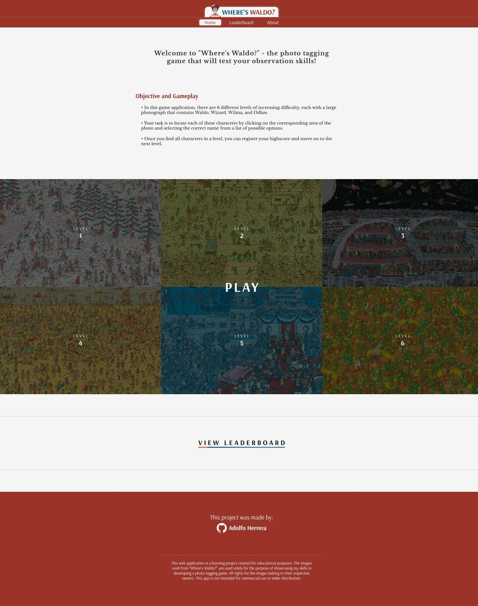

<h1 align="center">Where is Waldo?</h1>

## Description

"Where is Waldo?" is a photo-tagging application that incorporates a backend using Firebase. The objective of the project is to find Waldo and other hidden characters within six different levels.

To win the game, the user must locate four hidden characters within each level. Once all the characters are found, a modal will appear, allowing the user to enter their username and register their score on the leaderboard.

Here are some key features of the application:

- Character coordinates and leaderboard scores for each level are stored in Firebase's Firestore Database.
- Redux is utilized to store level data, current game information (score, date, characters status, characters, current level, game status).
- Data for each level is fetched only once when a level is selected. If the user plays the same level again, the data is already available in the Redux store.

### My Learning Experience

During the development of "Where is Waldo?", I had the opportunity to learn several new things, particularly in working with the backend and managing a database to store sensitive user information securely.

Using Firebase for the backend provided valuable insights into its services. For this project, I made use of Firestore, and in future iterations, I may consider implementing Authentication to restrict access to logged-in users only.

While planning the application's architecture, I realized the need for a centralized location to store fetched data and game information. In a previous [project](https://github.com/Wolfushima/react-shopping-cart) I did, I used the React hook Context, which served its purpose well. However, for this project, I decided to delve into Redux, seeing it as an excellent opportunity to learn before undertaking more extensive projects.

One challenge I encountered with Redux was integrating it with Firebase. I had to implement it into the Redux store and utilize it as an API to fetch data and perform read and write operations. To overcome this challenge, I utilized the 'createApi' feature from Redux ToolKit(RTK) which allowed me to define a set of endpoints that described how to retrive data from backend APIs and other async sources, including the configuration of how to fetch and transform that data, which in this case was from Firebase's service Firestore.

## Demo

[Where is Waldo?](https://wolfushima.github.io/where-is-waldo/)

## Showcase

[where-is-waldo-showcase](./readme-assets/where-is-waldo-showcase.mp4)

## Features

- **Responsive Design**: Where is Waldo? is designed to be responsive on all devices, utilizing media queries for optimal display.
- **Leaderboard**: The application includes a comprehensive leaderboard that showcases scores registered for all six levels. The data is stored in Firebase's Firestore service.
- **Backend**: Firebase's Firestore service is utilized as a live backend database for seamless data storage and retrieval.
- **Redux**: Redux is employed to effectively manage and update data across multiple components.

## Technologies Used

- Firebase
- React
- React Router
- Redux
- HTML
- CSS
- Git
- Sass
- Date-fns

## Copyright

This web application is a learning project created for educational purposes. The images used from "Where's Waldo?" are used solely for the purpose of showcasing my skills in developing a photo tagging game. All rights for the images belong to their respective owners. This app is not intended for commercial use or wider distribution.
